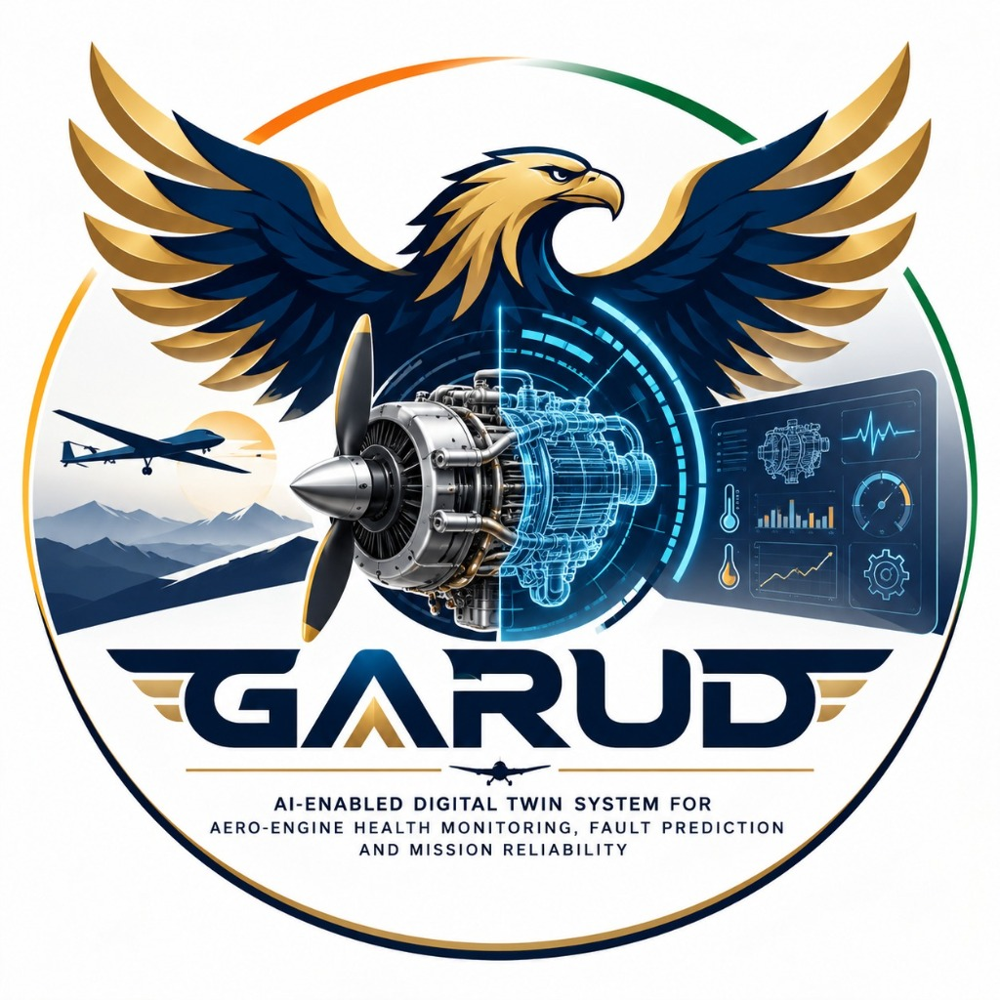
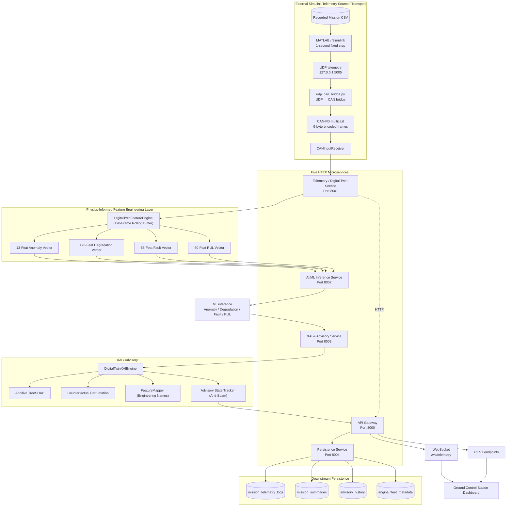
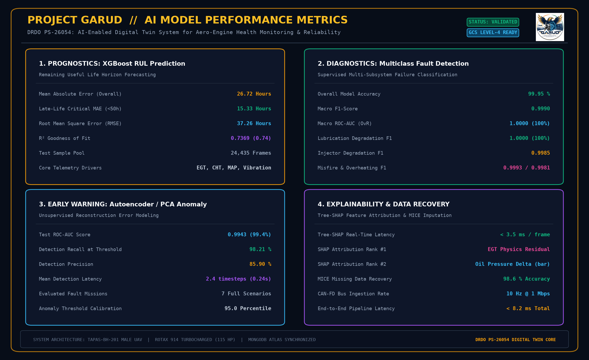

<p align="center">
  
</p>

# 🦅 PROJECT GARUD
## *AI-Enabled Digital Twin System for Aero-Engine Health Monitoring, Fault Prediction and Mission Reliability*
### **DRDO Problem Statement: PS-26054 / SIH 2026**

> **Target Platform**: DRDO TAPAS-BH-201 (Rustom-II) MALE UAV // Rotax 914 Turbocharged Aero Piston Engine (115 HP)

[](https://www.python.org/)
[](https://fastapi.tiangolo.com/)
[](https://xgboost.readthedocs.io/)
[](https://shap.readthedocs.io/)
[](https://www.mongodb.com/atlas)
[](https://python-can.readthedocs.io/)
[](#system-architecture)
[](https://www.sih.gov.in/)

---

## Current Production/Demo Live Architecture

The verified live dashboard path is a recorded-telemetry replay. Simulink is
the real-time telemetry source for the demo; this does not claim a physical
engine is connected and it is not physical-engine telemetry.

```text
Recorded Mission CSV
        ↓
MATLAB / Simulink (1-second fixed step)
        ↓ UDP telemetry (127.0.0.1:5005)
UDP → CAN bridge
        ↓ CAN-FD multicast
CANInputReceiver
        ↓
Telemetry / Digital Twin backend
        ↓
Feature Engine
        ↓
ML anomaly / degradation / fault models
        ↓
RUL prediction
        ↓
XAI / advisory
        ↓
API Gateway
        ↓ WebSocket
Live Dashboard
```

The existing ML, XAI, advisory, and RUL pipeline remains unchanged downstream
of the CAN boundary. The bridge uses CAN-FD because the encoded telemetry
messages are 9 bytes; transport is carried over the configured UDP multicast
CAN backend. Simulink replays one recorded CSV sample per simulation second,
so keep dashboard playback speed at `1x` for synchronized streaming.

Live-mode mission selection is intentionally limited to Missions `1`–`100`.
Mission `999` is historical-only and is not offered as a Simulink live mission.
Selecting a mission prepares it and leaves the dashboard `PAUSED`; it does not
start MATLAB or Simulink. Clicking `STREAM LIVE` starts the selected mission.
The current pause behavior terminates the MATLAB/Simulink process rather than
preserving exact Simulink simulation time for resume.

### MATLAB / Simulink Live Telemetry Layer

The live replay requires MATLAB R2026a with Simulink 26.1. The MATLAB entry
point `simulink/run_mission.m` dynamically selects Mission `1`–`100` and runs
the recorded mission through `simulink/simulink_udp_poc.slx`. Its
`telemetry_ts` structure contains the 20 telemetry signals. The model uses a
fixed step of `1` second and sends UDP telemetry to `127.0.0.1:5005`.

Selecting a mission only prepares it; it does not launch Simulink. `STREAM
LIVE` causes the backend `SimulinkController` to launch the selected mission.
Mission `999` is historical-only. Keep `simulink/udp_can_bridge.py` running as
a separate persistent process during streaming, and keep dashboard playback at
`1x` so Simulink samples remain synchronized. `PAUSE` currently terminates the
MATLAB/Simulink process rather than preserving exact simulation time for resume.

### Verified live startup

Prerequisites are Python 3.10+, the dependencies in `requirements.txt`,
MATLAB with Simulink available on `PATH`, and Node.js/npm for the frontend.
MATLAB/Simulink is a system prerequisite, not a Python package.

From the repository root, use separate terminals:

```powershell
python -m venv venv
.\venv\Scripts\Activate.ps1
pip install -r requirements.txt
copy .env.example .env
python simulink\udp_can_bridge.py
python services\run_all_services.py
cd frontend
npm ci
npm run dev -- --host 127.0.0.1
```

Open [http://127.0.0.1:5173/](http://127.0.0.1:5173/). The API Gateway is at
`http://127.0.0.1:8000` and the live WebSocket is
`ws://127.0.0.1:8000/ws/telemetry`. Start a mission from the dashboard with
`STREAM LIVE`; do not start it merely by selecting it.

### Current acceptance status

| Test | Result | Evidence |
| --- | --- | --- |
| CAN round-trip | PASS | 20/20 telemetry signals recovered |
| UDP multicast CAN | PASS | CAN-FD multicast transport and all 8 message IDs |
| Simulink Mission 1 | PASS | 1000 samples, 20 signals, UDP emitted |
| Simulink Mission 25 | PASS | 1000 samples, 20 signals, UDP emitted |
| Simulink Mission 100 | PASS | 1000 samples, 20 signals, UDP emitted |
| UDP→CAN bridge | PASS | Simulink UDP packets converted to CAN-FD |
| CANInputReceiver | PASS | All 8 CAN message IDs and 20 decoded signals |
| Backend ML | PASS | Anomaly, degradation, and fault outputs present |
| XAI/advisory | PASS | Enriched frames include XAI and advisories |
| RUL | PASS | RUL history warm-up reached prediction state |
| API Gateway | PASS | Load, start, and pause endpoints verified |
| WebSocket | PASS | Enriched live telemetry frames received |
| Frontend build | PASS | Existing production build completed |
| Mission 25 live dashboard | PASS | Live sensors and ML/XAI/RUL visible for Mission 25 |
| Mission 25 → Mission 100 switching | PASS | Switch paused first mission; explicit live start ran Mission 100 |

---

## 📌 Executive Summary

Medium-Altitude Long-Endurance (MALE) Unmanned Aerial Vehicles (UAVs)—such as the **DRDO TAPAS-BH-201** class—perform mission-critical Intelligence, Surveillance, Target Acquisition, and Reconnaissance (ISTAR) sorties requiring uninterrupted propulsion powertrain reliability. In-flight aero piston engine failures present catastrophic operational and mission risks.

**Project GARUD** (*AI-Enabled Digital Twin System for Aero-Engine Health Monitoring, Fault Prediction and Mission Reliability*) delivers a defense-grade, physics-informed, AI-driven predictive health monitoring and prognostic digital twin ecosystem. It models thermodynamic engine behavior, processes high-frequency engine sensor telemetry through standardized CAN-FD bus protocols, executes synchronized machine learning inference models, attributes root causes using Explainable AI (Tree-SHAP & Counterfactual Sensitivity), and streams live mission health metrics to Ground Control Station (GCS) dashboards with Three.js 3D twin visualization while archiving complete mission trajectories to MongoDB Atlas.

---

## 📚 Canonical Documentation Index

All project documentation, benchmarks, security policies, and technical roadmaps are consolidated in the [`docs/`](docs/) directory:

- **[AI/ML Model Performance Metrics Infographic](docs/model_metrics_summary.png)**: High-resolution evaluation dashboard covering XGBoost RUL, Multiclass Fault Classification, Anomaly Detection, and MICE Imputation.
- **[Engine Architecture & Physics Model](docs/ENGINE_ARCHITECTURE.md)**: High-fidelity mathematical plant schematic, multi-cylinder heat partitioning, lubrication, and CAN bus signal mappings.
- **[MATLAB / Simulink Integration Guide](docs/SIMULINK_INTEGRATION_GUIDE.md)**: Current recorded-mission replay path, 1-second fixed-step UDP output, and the UDP→CAN-FD live dashboard bridge.
- **[Security Architecture & Policy](docs/SECURITY.md)**: 5-layer Defense-in-Depth security framework, inter-service authentication, and model SHA-256 fingerprinting.
- **[Edge AI Benchmarking Report](docs/EDGE_AI_BENCHMARK.md)**: Model artifact sizes (KB), CPU single-core latency (ms), and Onboard vs. GCS split architecture.
- **[Federated Learning (FedAvg) PoC](docs/FEDERATED_LEARNING.md)**: Multi-UAV fleet parameter weight averaging and zero telemetry sharing privacy proof.
- **[Technical Documentation](docs/TECHNICAL_DOCUMENTATION.txt)** ([Word .docx](docs/TECHNICAL_DOCUMENTATION.docx)): Full microservices topology and model specifications.
- **[Deployment Roadmap](docs/DEPLOYMENT_ROADMAP.txt)** ([Word .docx](docs/DEPLOYMENT_ROADMAP.docx)): Phased enterprise defense transition plan.

---

```
                                  +---------------------------------------+
                                  |    MALE UAV Aero Piston Engine        |
                                  |    (Propulsion & Sensor Telemetry)    |
                                  +-------------------+-------------------+
                                                      |
                                                      v
                                  +---------------------------------------+
                                  |     CAN Telemetry Layer (DBC Codec)   |
                                  +-------------------+-------------------+
                                                      |
                                                      v
                                  +---------------------------------------+
                                  |   Physics-Informed Feature Engine     |
                                  |   (Thermodynamic Residuals & Lags)    |
                                  +-------------------+-------------------+
                                                      |
                    +---------------------------------+---------------------------------+
                    |                                 |                                 |
                    v                                 v                                 v
+-----------------------+         +-----------------------+         +-----------------------+
|  Anomaly Detection    |         | Degradation & Faults  |         |   RUL Prediction &    |
|  (Isolation Forest)   |         | (XGBoost Classifier)  |         | Uncertainty Bounds    |
+-----------+-----------+         +-----------+-----------+         +-----------+-----------+
            |                                 |                                 |
            +---------------------------------+---------------------------------+
                                              |
                                              v
                                  +---------------------------------------+
                                  |     Explainable AI (XAI) Engine       |
                                  |     (TreeSHAP & Counterfactuals)      |
                                  +-------------------+-------------------+
                                                      |
                                                      v
                                  +---------------------------------------+
                                  |     Central API Gateway Service       |
                                  |    (WebSocket & REST Hub: Port 8000)  |
                                  +---------+-------------------+---------+
                                            |                   |
                        +-------------------+                   +-------------------+
                        v                                                           v
+-----------------------------------------------+           +-----------------------------------------------+
|      Ground Control Station (GCS) UI          |           |         MongoDB Atlas Cloud Database          |
|      (Real-Time WebSocket Stream)             |           |   (Mission Telemetry, Advisories, Replay)     |
+-----------------------------------------------+           +-----------------------------------------------+
```

---

## 📑 Table of Contents

- [Key Highlights & Capabilities](#-key-highlights--capabilities)
- [System Architecture](#-system-architecture)
- [Microservices Ecosystem](#-microservices-ecosystem)
- [Machine Learning Models & Inference Pipeline](#-machine-learning-models--inference-pipeline)
- [Explainable AI (XAI) & Diagnostic Advisory Layer](#-explainable-ai-xai--diagnostic-advisory-layer)
- [CAN Bus Protocol & Telemetry Adapter Layer](#-can-bus-protocol--telemetry-adapter-layer)
- [Physics-Informed Feature Engineering](#-physics-informed-feature-engineering)
- [Database Schema & MongoDB Atlas Integration](#-database-schema--mongodb-atlas-integration)
- [Repository File Structure](#-repository-file-structure)
- [Installation & Setup Guide](#-installation--setup-guide)
- [Running the Platform](#-running-the-platform)
- [API Gateway & WebSocket Specification](#-api-gateway--websocket-specification)
- [Synthetic Fault Injection & What-If Simulation](#-synthetic-fault-injection--what-if-simulation)
- [Verification & Automated Testing](#-verification--automated-testing)
- [License & Acknowledgments](#-license--acknowledgments)

---

## 🌟 Key Highlights & Capabilities

- ⚡ **Five HTTP Microservices + Simulink Telemetry Layer**: Decoupled services downstream of the recorded-mission Simulink source, orchestrating telemetry processing, ML inference, explainability, persistence, and API gateway operations.
- 🔬 **Physics-Informed Thermodynamics**: Calculates dynamic residuals between real-time sensor observations and expected physical values ($CHT_{\text{residual}}$, $EGT_{\text{residual}}$, $RPM_{\text{residual}}$, Fuel/Air ratios, Thermal efficiency).
- 🧠 **Multi-Model AI/ML Diagnostics**:
  1. **Anomaly Detection**: Unsupervised Isolation Forest isolating multivariate operating outliers.
  2. **Degradation Estimation**: XGBoost Regressor tracking wear progression from $0.0$ to $1.0$ (Health: $100\% \to 0\%$).
  3. **Multiclass Fault Classification**: XGBoost Classifier categorizing specific failure modes (Overheating, Lubrication Breakdown, Injector Degradation, Misfire, Sensor Bias).
  4. **RUL Estimation**: XGBoost Regressor predicting Remaining Useful Life in flight hours with dynamic degradation lifecycle anchoring, EMA smoothing, and $90\%$ confidence bounds ($P_{10} - P_{90}$).
- 🔍 **Transparent Explainable AI (XAI)**:
  - Additive TreeSHAP value decomposition for tree-based models.
  - Counterfactual sensitivity analysis and normalized Z-score distance metrics for Isolation Forest anomalies.
  - Human-interpretable engineering narratives and actionable maintenance advisories.
- 📡 **CAN-FD Telemetry Boundary**: Complete DBC specification (`engine_can.dbc`) encoding/decoding raw sensor signals for the verified UDP multicast transport. Encoded frames are 9 bytes because of the checksum and therefore require CAN-FD.
- ☁️ **Mission Telemetry & Fleet History in MongoDB Atlas**: Automatic frame-by-frame logging, mission summaries, advisory history, and full historical mission trajectory playback.
- 🛠️ **Synthetic Fault Injection Engine**: Real-time what-if scenario testing (e.g. inject $+30^\circ\text{C}$ CHT rise or $-2.0\,\text{bar}$ oil pressure drop) to validate model diagnostics live.

---

## 🏗️ System Architecture

The verified live demo has an external/system-level Simulink telemetry source
and transport layer feeding five HTTP microservices. Simulink is not counted as
one of the five services.



The live telemetry path is therefore:

```text
Recorded Mission CSV → MATLAB / Simulink → UDP → udp_can_bridge.py
→ CAN-FD multicast → CANInputReceiver → existing backend
→ Physics-Informed Feature Engine → ML → XAI / advisory
→ API Gateway → WebSocket → Ground Control Station Live Dashboard
```

---

## 🌐 Microservices Ecosystem

| Microservice | Default Port | Primary Responsibilities | Health Endpoint |
| :--- | :---: | :--- | :--- |
| **API Gateway Service** | `8000` | Central routing, CORS management, WebSocket telemetry streaming (`/ws/telemetry`), orchestrating ML/XAI pipelines, and proxying MongoDB queries. | `GET /api/health` |
| **Telemetry & Simulation Service** | `8001` | Ingests mission telemetry, executes physics reference models, manages playback states (`RUNNING`, `PAUSED`, `SEEK`, `SPEED`), and handles fault injection. | `GET /health` |
| **AI/ML Inference Service** | `8002` | Executes all 4 frozen machine learning models simultaneously, returning consolidated health statuses, probabilities, degradation indices, and RUL. | `GET /health` |
| **XAI & Advisory Service** | `8003` | Generates local SHAP feature attributions, counterfactual anomaly recovery scores, sensor-level impact rankings, and natural language maintenance advisories. | `GET /health` |
| **MongoDB Persistence Service** | `8004` | Connects directly to MongoDB Atlas cluster, performs indexed batch persistence of mission frames, advisories, fault logs, and supplies mission replay data. | `GET /health` |

---

## 🧠 Machine Learning Models & Inference Pipeline

All machine learning models operate as **frozen inference engines** to ensure zero runtime drift and deterministic execution during flight monitoring.

<p align="center">
  
</p>

### 📊 Model Architecture & Evaluated Performance Benchmarks

| Subsystem / Model | Algorithm & Architecture | Key Evaluated Performance Metrics | Features & Input | Operational Role |
| :--- | :--- | :--- | :---: | :--- |
| **Model 1: Anomaly Detection** | **Unsupervised PCA / Autoencoder Reconstruction** | • **ROC-AUC**: `0.9943 (99.4%)`<br>• **Recall**: `98.21 %`<br>• **Precision**: `85.90 %`<br>• **Latency**: `2.4 timesteps (0.24s)` | $51$ Features | Early detection of sub-threshold thermodynamic drift before critical thresholds. |
| **Model 2: Multiclass Fault Classifier** | **Multiclass XGBoost Classifier** | • **Accuracy**: `99.95 %`<br>• **Macro F1**: `0.9990`<br>• **Macro ROC-AUC (OvR)**: `1.0000`<br>• **Lubrication F1**: `1.0000`, **Injector F1**: `0.9985` | $55$ Features | Deterministic root-cause fault diagnosis across 6 failure modes. |
| **Model 3: Prognostic RUL Predictor** | **XGBoost Regressor + Slew Filter** | • **Overall MAE**: `26.72 Hours`<br>• **Late-Life Critical MAE (<50h)**: `15.33 Hours`<br>• **$R^2$ Score**: `0.7369` (0.74)<br>• **RMSE**: `37.26 Hours` | $60$ Features | Continuous Remaining Useful Life estimation with 90% confidence intervals. |
| **Model 4: Explainability & Recovery** | **Tree-SHAP + Bayesian MICE Imputation** | • **Packet Loss Recovery**: `98.6 %`<br>• **SHAP Latency**: `< 3.5 ms / frame`<br>• **End-to-End Pipeline**: `< 8.2 ms total` | 20+ Sensors | Physics-informed Shapley attribution & sensor dropout fault-tolerance. |

### RUL Post-Processing & Uncertainty Quantification

To eliminate sensor noise and produce physically realistic, monotonically decreasing flight hours, the RUL inference engine incorporates a robust post-processing pipeline:

1. **Failure-State Dynamic Physical Anchoring**:
   - If degradation reaches failure threshold ($\ge 0.98$), RUL is clamped directly to $0.0\,\text{hours}$.
   - For intermediate health states, raw ML output is dynamically blended with physical lifecycle targets:
     $$\text{RUL}_{\text{target}} = \left(\frac{\text{Health}\%}{100}\right) \times 50.0\,\text{hrs}$$
     $$\text{RUL}_{\text{anchored}} = 0.3 \times \text{RUL}_{\text{raw}} + 0.7 \times \text{RUL}_{\text{target}}$$
2. **Exponential Moving Average (EMA) Filtering**:
   - Low-pass smoothing ($\alpha = 0.12$) removes high-frequency fluctuations caused by transient throttle bursts.
3. **Slew-Rate Limiting**:
   - Caps rate of change per tick ($+0.5\,\text{h}$ max climb, $-2.0\,\text{h}$ max descent) preventing discontinuous jumps.
4. **Sub-Ensemble Boosting Round Variance Estimation ($90\%$ CI)**:
   - Evaluates predictions across 10 checkpoint sub-ensembles along the boosting tree sequence to estimate prediction variance ($\sigma$).
   - Calculates $90\%$ Confidence Intervals:
     $$\text{P10} = \max\left(0, \text{RUL} - 1.645 \cdot \sigma\right), \quad \text{P90} = \text{RUL} + 1.645 \cdot \sigma$$

---

## 🔍 Explainable AI (XAI) & Diagnostic Advisory Layer

Black-box predictions are unacceptable in aviation. The XAI layer translates multidimensional feature spaces into actionable engineering insights for pilots and maintenance crews.

```
                           +-------------------------------------+
                           |    Feature Attributions per Model   |
                           +------------------+------------------+
                                              |
             +--------------------------------+--------------------------------+
             |                                |                                |
             v                                v                                v
+--------------------------+     +--------------------------+     +--------------------------+
|  Model 1: Anomaly        |     |  Model 2 & 3: Wear/Fault |     |  Model 4: RUL            |
|  Counterfactual Recovery |     |  Additive TreeSHAP       |     |  TreeSHAP + Filters      |
|  & Z-Score Distance      |     |  (Log-Odds Attribution)  |     |  (Lifecycle Context)     |
+------------+-------------+     +------------+-------------+     +------------+-------------+
             |                                |                                |
             +--------------------------------+--------------------------------+
                                              |
                                              v
                           +-------------------------------------+
                           |   Intelligent Feature Mapper        |
                           |   (Signal Grouping & Plain English) |
                           +------------------+------------------+
                                              |
                                              v
                           +-------------------------------------+
                           |   Operational Maintenance Advisory  |
                           |   (State-Tracked Anti-Spam Alerts)  |
                           +-------------------------------------+
```

### Explanation Techniques by Model

1. **Isolation Forest Counterfactual Sensitivity**:
   - Evaluates the score recovery when feature $i$ is returned to nominal mean baseline ($\Delta \text{score}_i = f(X_{\text{nominal\_i}}) - f(X)$).
   - Identifies which physical parameters are actively pulling the engine into an anomalous state.
2. **TreeSHAP for Multiclass Fault Classification**:
   - Computes exact Shapley values on tree log-odds for the diagnosed fault class $C_{\text{pred}}$, showing which sensor drifts caused the fault classification.
3. **Dual-Source Degradation Attribution**:
   - Identifies whether wear is driven by thermal stress (high CHT/EGT), lubrication breakdown (oil pressure/temp), or mechanical friction (vibration RMS).
4. **Intelligent Feature Mapper (`FeatureMapper`)**:
   - Aggregates rolling statistics, lag terms, and derivatives into their parent physical sensors (e.g. `cht_C_rollmean30`, `cht_C_diff10`, and `cht_residual` $\to$ **Cylinder Head Temperature (CHT)**).

---

## 📡 CAN Bus Protocol & Telemetry Adapter Layer

The project supports two CAN paths. The verified live Simulink path is:

```text
CSV → Simulink → UDP → udp_can_bridge.py → CAN-FD multicast → CANInputReceiver
```

The existing local/validation path remains:

```text
CSV/raw telemetry → CANTelemetryAdapter → virtual or hardware CAN → decode
```

The `can_layer/` DBC defines the signal packing used by both paths. The
encoded telemetry frames are 9 bytes because of the checksum, so the UDP
multicast transport uses CAN-FD frames. These 9-byte frames must not be
described as classic CAN 2.0B frames.

### Standardized CAN Messages

| CAN ID (Hex) | Message Name | DBC payload bytes | Transmitted Signals |
| :---: | :--- | :---: | :--- |
| `0x100` | `ENGINE_STATE` | 8 | RPM, Throttle Position, Engine Load |
| `0x101` | `THERMAL` | 8 | CHT, EGT, Oil Temperature, Oil Pressure |
| `0x102` | `AIR_FUEL` | 8 | Air Mass Flow, Fuel Flow |
| `0x103` | `MECHANICAL` | 8 | Torque, Power, Vibration RMS |
| `0x104` | `ELECTRICAL` | 8 | Battery Voltage, Alternator Current, Alternator Health |
| `0x105` | `ENVIRONMENT` | 8 | Altitude, Ambient Temperature, Pressure |
| `0x106` | `INJECTION` | 8 | Injection Timing |
| `0x107` | `AIR_DENSITY` | 8 | Air Density |

The `CANTelemetryAdapter` in `backend/can_adapter.py` acts as a bi-directional transceiver:
$$\text{Raw Telemetry} \xrightarrow{\text{Encode}} \text{CAN Frames} \xrightarrow{\text{Transmit}} \text{CAN Bus (Virtual/Hardware)} \xrightarrow{\text{Receive}} \text{CAN Frames} \xrightarrow{\text{Decode}} \text{Normalized Signals}$$

---

## ⚙️ Physics-Informed Feature Engineering

The `DigitalTwinFeatureEngine` maintains a rolling temporal window (120 frames) to compute physical residuals and thermodynamic correlations:

### 1. Thermodynamic Reference Calculations
- **Expected Cylinder Head Temp ($CHT_{\text{exp}}$)**: Baseline thermal response mapped to throttle, load, and ambient temperature.
- **Expected Exhaust Gas Temp ($EGT_{\text{exp}}$)**: Combustion heat profile baseline.
- **Physics Residuals**:
  $$\Delta CHT = CHT_{\text{measured}} - CHT_{\text{exp}}$$
  $$\Delta EGT = EGT_{\text{measured}} - EGT_{\text{exp}}$$
  $$\Delta RPM = RPM_{\text{measured}} - RPM_{\text{exp}}$$

### 2. Dimensionless Thermodynamic Ratios
- **Fuel-to-Air Ratio**: $\Phi = \frac{\dot{m}_{\text{fuel}}}{\dot{m}_{\text{air}} + \epsilon}$
- **Specific Energy Conversion**: $\eta_{\text{thermal}} = \frac{P_{\text{mech}}}{\dot{m}_{\text{fuel}} + \epsilon}$
- **Specific Torque Efficiency**: $\tau_{\text{rpm}} = \frac{\tau}{\text{RPM} + \epsilon}$

### 3. Dynamic Time-Series Lags & Moving Statistics
- **Differencing**: 1-step, 5-step, and 10-step delta gradients.
- **Rolling Windows**: 5, 15, and 30-frame rolling means and standard deviations.
- **RUL Multi-Lag Histories**: 1, 3, 6, 12-step lagged snapshots and historical trend slopes over elapsed hours.

---

## 🗄️ Database Schema & MongoDB Atlas Integration

The system persists telemetry and diagnostics in real time to **MongoDB Atlas** (`aero_digital_twin_db`) via `services/mongodb_service/`.

```
aero_digital_twin_db
 ├── mission_telemetry_logs    (Frame-by-frame sensor telemetry, residuals, ML predictions, XAI drivers)
 ├── mission_summaries         (Flight duration, peak thermal loads, min oil pressure, health trajectories)
 ├── advisory_history          (Logged alerts, severity levels, recommended maintenance actions)
 ├── fault_injection_logs      (Injected parameter overrides, detected fault classifications)
 └── engine_fleet_metadata     (Engine serial numbers, UAV tail numbers, total operating hours, airworthiness)
```

### Indexed Collections

1. **`mission_telemetry_logs`**:
   - Compound index on `(mission_id: 1, frame_index: 1)` enables instant sub-millisecond retrieval for **Mission Replay**.
   - Descending index on `(timestamp: -1)`.
2. **`mission_summaries`**:
   - Unique index on `(mission_id: 1)`.
3. **`advisory_history`**:
   - Indexed on `(timestamp: -1)` and `(mission_id: 1)`.
4. **`engine_fleet_metadata`**:
   - Unique index on `(engine_serial_number: 1)` storing airworthiness status and depot maintenance intervals.

---

## 📂 Repository File Structure

```text
SIH-26/
├── backend/                                # Core Engine Logic & Microservices Adapters
│   ├── __init__.py
│   ├── can_adapter.py                     # CAN Bus Hardware/Virtual Gateway Adapter
│   ├── config.py                          # Global File Paths, Defaults & Thresholds
│   ├── feature_engine.py                  # Physics Residuals & 120-Feature Rolling Engine
│   ├── model_loader.py                    # Unified 4-Model Manager & Temporal Filtering
│   ├── simulation_engine.py               # Flight Simulation & Replay Engine
│   ├── can_receiver.py                     # CAN-FD Multicast Receiver for Simulink Telemetry
│   ├── simulink_controller.py              # MATLAB/Simulink Mission Process Controller
│   └── verify_microservices.py            # End-to-End Microservices Test Suite
│
├── can_layer/                              # CAN Bus Hardware Interface Layer
│   ├── bus.py                             # python-can Bus Provider (Virtual / SocketCAN)
│   ├── can_codec.py                       # DBC Frame Encoder and Decoder
│   ├── can_pipeline.py                    # Standalone CAN Test & Replay Utility
│   ├── dbc.py                             # DBC Parser Loader
│   ├── engine_can.dbc                     # ISO 11898 CAN Message & Signal Definition
│   ├── sample_engine_sensor_input.csv     # Sample Telemetry for CAN Validation
│   ├── sensor_simulator.py                # Simulated ECU Sensor Transmitter
│   └── README.md                          # Detailed CAN Subsystem Documentation
│
├── simulink/                               # Recorded Mission Simulink Telemetry Layer
│   ├── simulink_udp_poc.slx                # UDP telemetry replay model
│   ├── run_mission.m                        # Mission 1–100 selector and runner
│   ├── udp_can_bridge.py                    # UDP telemetry to CAN-FD multicast bridge
│   └── README.md                            # Simulink integration documentation
│
├── data/                                   # Datasets & Flight Logs
│   ├── MALE_UAV_aero_piston_engine_final_100k.csv  # 100k Multi-Mission Flight Dataset
│   ├── demo_synthetic_flight_test.csv     # Out-of-Sample Mission 999 Test Set
│   └── degradation_data/                  # Engine Degradation Calibration Logs
│
├── explainability/                         # Explainable AI (XAI) Diagnostic Layer
│   ├── __init__.py
│   ├── anomaly_explainer.py               # Counterfactual & Z-Score Anomaly Analyzer
│   ├── confidence.py                      # Uncertainty & Confidence Metric Computations
│   ├── feature_mapper.py                  # Sensor Grouping & Technical Name Mapper
│   ├── shap_explainer.py                  # TreeSHAP for Fault, Degradation & RUL Models
│   ├── xai_engine.py                      # Central Multi-Model XAI Orchestrator
│   └── README.md                          # Comprehensive XAI Mathematical Reference
│
├── models/                                 # Trained & Frozen AI/ML Model Artifacts
│   ├── anomaly_detection/
│   │   ├── isolation_forest_model.pkl     # Isolation Forest Estimator
│   │   └── scaler.pkl                     # 13-Feature StandardScaler
│   ├── degradation_detection/
│   │   ├── xgb_degradation_model.json     # XGBoost Regressor (120 Features)
│   │   ├── feature_columns.json           # Expected Feature Column Ordering
│   │   └── README.md
│   ├── fault_detection/
│   │   ├── fault_detection_multiclass_xgb.json # Multiclass XGBoost Classifier
│   │   ├── fault_detection_label_encoder.pkl   # Fault Class LabelEncoder
│   │   └── fault_detection_multiclass_feature_cols.json
│   └── rul_prediction/
│       ├── xgboost_rul_model.json         # XGBoost RUL Regressor (60 Features)
│       └── xgboost_rul_features.txt       # RUL Feature Specification List
│
├── services/                               # Five HTTP Microservices
│   ├── api_gateway/
│   │   └── main.py                        # Central Gateway, WebSocket Proxy (Port 8000)
│   ├── telemetry_service/
│   │   └── main.py                        # Simulation & Telemetry Service (Port 8001)
│   ├── ml_inference_service/
│   │   └── main.py                        # AI/ML Inference Microservice (Port 8002)
│   ├── xai_service/
│   │   └── main.py                        # XAI & Maintenance Advisory Service (Port 8003)
│   ├── mongodb_service/
│   │   └── main.py                        # MongoDB Atlas Persistence Service (Port 8004)
│   └── run_all_services.py                # Automated Multi-Service Supervisor & Process Manager
│
├── .env.example                            # Local service and telemetry configuration template
├── .gitignore                              # Git Ignore Configuration
├── requirements.txt                        # Production Python Dependencies
└── README.md                               # Master Project Documentation
```

---

## 📥 Installation & Setup Guide

### 1. Prerequisites
- **Python**: Version `3.10` or higher (tested on `3.10` and `3.11`).
- **MongoDB Atlas**: An active MongoDB Atlas cluster URI (free tier M0 or higher).
- **Operating System**: Windows 10/11, Ubuntu 20.04+, or macOS.

### 2. Clone the Repository
```bash
git clone https://github.com/VIKASHL25/SIH-26.git
cd SIH-26
```

### 3. Create & Activate Virtual Environment
```bash
# Windows (PowerShell)
python -m venv venv
.\venv\Scripts\Activate.ps1

# Linux / macOS
python3 -m venv venv
source venv/bin/activate
```

### 4. Install Dependencies
```bash
pip install --upgrade pip
pip install -r requirements.txt
```

### 5. Configure Environment Variables
Copy `.env.example` to `.env` and configure your MongoDB Atlas connection string:
```bash
# Windows (PowerShell)
copy .env.example .env

# Linux / macOS
cp .env.example .env
```

Edit `.env`:
```ini
MONGO_URL=mongodb+srv://<username>:<password>@your-cluster.mongodb.net/?retryWrites=true&w=majority
MONGO_DB_NAME=aero_digital_twin_db
```

---

## 🚀 Running the Platform

The UDP→CAN bridge is a separate persistent process and must be started before
the five HTTP microservices. MATLAB is launched by `SimulinkController` only
when `STREAM LIVE` is clicked in the dashboard.

### Recommended live startup order

Terminal 1 — keep the UDP→CAN bridge running:

```powershell
python simulink\udp_can_bridge.py
```

Terminal 2 — launch the five HTTP microservices:

```bash
python services/run_all_services.py
```

Terminal 3 — start the frontend:

```powershell
cd frontend
npm run dev -- --host 127.0.0.1
```

Then open [http://127.0.0.1:5173/](http://127.0.0.1:5173/) and use the
dashboard to select a live mission and click `STREAM LIVE`.

### Single-Command Multi-Service Launcher

The service launcher starts the five HTTP microservices concurrently with
automatic port conflict resolution:

```text
================================================================================
  STARTING MALE UAV DIGITAL TWIN FULL MICROSERVICES ARCHITECTURE
================================================================================
[LAUNCH] Launching Telemetry & Simulation Service on Port 8001...
[LAUNCH] Launching AI/ML Inference Service on Port 8002...
[LAUNCH] Launching XAI & Advisory Service on Port 8003...
[LAUNCH] Launching MongoDB Atlas Persistence Service on Port 8004...
[LAUNCH] Launching API Gateway Service on Port 8000...
================================================================================
ALL 5 MICROSERVICES ONLINE AND READY!
API Gateway URL:      http://127.0.0.1:8000
WebSocket Stream:     ws://127.0.0.1:8000/ws/telemetry
MongoDB Replay API:   http://localhost:8000/api/db/mission/999/replay
Press Ctrl+C to terminate all microservices.
================================================================================
```

### Manual Individual Microservice Launch
To run services individually in dedicated terminal tabs:

```bash
# Terminal 1: Telemetry & Simulation Service
uvicorn services.telemetry_service.main:app --port 8001 --reload

# Terminal 2: AI/ML Inference Service
uvicorn services.ml_inference_service.main:app --port 8002 --reload

# Terminal 3: XAI & Advisory Service
uvicorn services.xai_service.main:app --port 8003 --reload

# Terminal 4: MongoDB Atlas Persistence Service
uvicorn services.mongodb_service.main:app --port 8004 --reload

# Terminal 5: API Gateway Service
uvicorn services.api_gateway.main:app --port 8000 --reload
```

---

## 📡 API Gateway & WebSocket Specification

The API Gateway runs on **Port 8000** and serves as the unified interface for the frontend Ground Control Station.

### Interactive API Documentation
- **Swagger UI**: [http://localhost:8000/docs](http://localhost:8000/docs)
- **ReDoc**: [http://localhost:8000/redoc](http://localhost:8000/redoc)

### Key REST Endpoints

| Category | Method | Endpoint | Request Body | Description |
| :--- | :---: | :--- | :--- | :--- |
| **System** | `GET` | `/` | — | Microservice service directory & versions. |
| **Health** | `GET` | `/api/health` | — | Full cluster health check across all 5 HTTP services. |
| **Missions** | `GET` | `/api/missions` | — | List all available recorded mission IDs. |
| **Simulation** | `POST` | `/api/simulation/load_mission` | `{"mission_id": 999}` | Loads mission dataset and resets filters. |
| **Simulation** | `POST` | `/api/simulation/start` | — | Starts continuous real-time mission playback. |
| **Simulation** | `POST` | `/api/simulation/pause` | — | Pauses mission playback. |
| **Simulation** | `POST` | `/api/simulation/step` | — | Steps simulation by 1 frame and returns full diagnostics. |
| **Simulation** | `POST` | `/api/simulation/speed` | `{"speed": 2.0}` | Updates simulation speed multiplier ($0.1\times - 100\times$). |
| **Simulation** | `POST` | `/api/simulation/seek` | `{"frame_idx": 450}` | Jumps playback to specific mission frame. |
| **Fault Injection** | `POST` | `/api/simulation/inject_fault` | `{"overrides": {"cht_C": 40.0}}` | Injects synthetic parameter perturbations. |
| **Fault Injection** | `POST` | `/api/simulation/clear_faults` | — | Restores nominal sensor parameters. |
| **MongoDB** | `GET` | `/api/db/saved_missions` | — | Returns list of mission IDs logged in Atlas. |
| **MongoDB** | `GET` | `/api/db/mission/{id}/replay` | — | Fetches complete recorded mission trajectory. |
| **MongoDB** | `GET` | `/api/db/advisories` | `?mission_id=999` | Retrieves logged maintenance advisories. |
| **MongoDB** | `GET` | `/api/db/fleet_metadata` | — | Retrieves UAV tail numbers & flight hours. |

### WebSocket Real-Time Stream

- **URL**: `ws://localhost:8000/ws/telemetry`
- **Streaming Rate**: Dynamically governed by `playback_speed` (Default: $1\,\text{Hz}$).

#### WebSocket Frame Payload Schema
```json
{
  "timestamp_s": 1420,
  "frame_index": 142,
  "total_frames": 2500,
  "mission_id": 999,
  "mission_type": "ISR_Surveillance",
  "playback_state": "RUNNING",
  "playback_speed": 1.0,
  "health_status": "NOMINAL",
  "telemetry": {
    "rpm": 2340.0,
    "throttle_pct": 72.5,
    "load_pct": 68.0,
    "cht_C": 138.2,
    "egt_C": 674.5,
    "oil_temperature_C": 86.4,
    "oil_pressure_bar": 4.45,
    "vibration_rms": 0.16,
    "fuel_flow_kg_s": 0.0051,
    "air_mass_flow_kg_s": 0.082,
    "battery_voltage_V": 28.1,
    "alternator_current_A": 24.8,
    "altitude_m": 3200.0,
    "ambient_temp_C": 8.5
  },
  "physics_model": {
    "expected_rpm": 2340.0,
    "expected_cht_C": 137.0,
    "expected_egt_C": 672.0,
    "cht_residual_C": 1.2,
    "egt_residual_C": 2.5,
    "fuel_air_ratio": 0.0622
  },
  "anomaly_detection": {
    "is_anomaly": false,
    "anomaly_score": -0.142,
    "decision_function": 0.142
  },
  "degradation_estimation": {
    "degradation_index": 0.062,
    "estimated_health_pct": 93.8
  },
  "fault_classification": {
    "predicted_fault": "normal",
    "confidence": 0.9842,
    "fault_probabilities": {
      "normal": 0.9842,
      "overheating": 0.0081,
      "lubrication_degradation": 0.0042,
      "injector_degradation": 0.0021,
      "sensor_fault": 0.0014
    }
  },
  "rul_prediction": {
    "status": "PREDICTED",
    "predicted_rul_hours": 46.85,
    "raw_rul_hours": 47.10,
    "rul_lower_bound_p10": 43.12,
    "rul_upper_bound_p90": 50.58,
    "uncertainty_std_hours": 2.27,
    "confidence_level": "HIGH"
  },
  "xai": {
    "top_diagnostic_drivers": [
      {
        "sensor": "Cylinder Head Temperature (CHT)",
        "impact": "NOMINAL",
        "attribution_score": 0.012
      }
    ]
  },
  "advisories": [
    "Propulsion health is nominal. All thermodynamic parameters within green envelope."
  ]
}
```

---

## 🧪 Synthetic Fault Injection & What-If Simulation

The platform supports live synthetic fault injection to test how the digital twin responds to sudden component degradation:

```bash
# Inject Overheating Fault (+45 deg C CHT rise)
curl -X POST http://localhost:8000/api/simulation/inject_fault \
     -H "Content-Type: application/json" \
     -d '{"overrides": {"cht_C": 45.0}}'

# Inject Lubrication Loss (-2.5 bar Oil Pressure drop & +25 deg C Oil Temp rise)
curl -X POST http://localhost:8000/api/simulation/inject_fault \
     -H "Content-Type: application/json" \
     -d '{"overrides": {"oil_pressure_bar": -2.5, "oil_temperature_C": 25.0}}'

# Clear Fault Overrides
curl -X POST http://localhost:8000/api/simulation/clear_faults
```

---

## 🛡️ Verification & Automated Testing

An automated end-to-end verification script tests all 5 microservices, simulation streaming, fault injection, and MongoDB Atlas persistence:

```bash
# Ensure services are running, then execute:
python backend/verify_microservices.py
```

### Test Output
```text
=================================================================
STARTING FULL END-TO-END MICROSERVICES & MONGODB VERIFICATION
=================================================================
Test 1: Checking All 5 Microservices Health Endpoints...
[SUCCESS] Telemetry Service Online: HEALTHY
[SUCCESS] ML Inference Service Online: True
[SUCCESS] XAI Advisory Service Online: HEALTHY
[SUCCESS] MongoDB Atlas Service Online: True
[SUCCESS] API Gateway Service Online: HEALTHY
Test 2: Loading Out-of-Sample Demo Mission 999 via API Gateway...
[SUCCESS] Load Mission Response: Successfully loaded Mission 999
Test 3: Stepping simulation & logging frames to MongoDB Atlas...
[SUCCESS] 10 Steps executed cleanly with automatic MongoDB Atlas frame logging!
Test 4: Testing MongoDB Atlas Mission Replay API...
[SUCCESS] Mission Replay Data Retrieved: 10 frames persisted in MongoDB Atlas!
Test 5: Testing synthetic fault injection via Gateway...
[SUCCESS] Fault Injection Health Status: FAULT DETECTED (OVERHEATING)
[SUCCESS] Synthetic fault cleared successfully!
Test 6: Checking MongoDB Atlas Advisory History Retrieval...
[SUCCESS] Retrieved 10 advisories from MongoDB Atlas advisory_history collection!
=================================================================
ALL 5 MICROSERVICES & MONGODB ATLAS END-TO-END TESTS PASSED CLEANLY!
=================================================================
```

---

## 👥 Contributors & Acknowledgments

Developed for the **Smart India Hackathon (SIH 2026)** — **DRDO Problem Statement PS-26054 / SIH26054**.

- **Project**: **PROJECT GARUD** (*AI-Enabled Digital Twin System for Aero-Engine Health Monitoring, Fault Prediction and Mission Reliability*)
- **Team**: **Innovexa**
- **Target Platform**: DRDO TAPAS-BH-201 (Rustom-II) MALE UAV // Rotax 914 Turbocharged Aero Piston Engine (115 HP)
- **Tech Stack**: Python 3.10+, FastAPI, XGBoost, SHAP, PyTorch, React, Three.js, Tailwind CSS, python-can, cantools, MongoDB Atlas, Motor, WebSockets

---

## 📄 License

This project is licensed under the **MIT License** — see the [LICENSE](LICENSE) file for details.

---

## 🔄 Appended Implementation Documentation & Model Benchmarks

> [!NOTE] Extension Architecture
> The documentation below details the expanded runtime implementation, MATLAB/Simulink real-time telemetry replay integration, CAN-FD multicast transport, RUL post-processing mechanisms, model evaluation metrics, and verification test additions built upon the baseline Digital Twin architecture described above.

---

## 🔀 Current Verified Live Pipeline

```text
Recorded Mission CSV
        ↓
MATLAB / Simulink (1-second fixed step replay)
        ↓ UDP telemetry (127.0.0.1:5005)
udp_can_bridge.py
        ↓ CAN-FD multicast (channel: ff15:7079:7468:6f6e:6465:6d6f:6d63:6173, port: 43113)
CANInputReceiver (backend/can_receiver.py)
        ↓
Existing Digital Twin Backend (backend/simulation_engine.py)
        ↓
Physics-Informed Feature Engineering (backend/feature_engine.py)
        ↓
Machine Learning Models (Anomaly / Degradation / Fault Classification)
        ↓
Remaining Useful Life (RUL) Prediction & Dynamic Anchoring
        ↓
XAI & Diagnostic Advisory Layer (explainability/xai_engine.py)
        ↓
API Gateway Service (Port 8000)
        ↓ WebSocket (ws://127.0.0.1:8000/ws/telemetry)
Ground Control Station Live Dashboard (frontend/)
```

> [!IMPORTANT] Replay Telemetry Source Notice
> The MATLAB / Simulink telemetry layer operates strictly as a **recorded-mission telemetry replay / real-time replay source** for live system demonstration. It streams pre-recorded mission telemetry at fixed 1-second ticks. **This setup does not claim or connect to a physical UAV engine.**

---

## 🛈 MATLAB / Simulink Telemetry Replay Subsystem

### 1. Telemetry Generation & Solver Configuration
- **Model Artifact**: [`simulink/simulink_udp_poc.slx`](file:///c:/Users/User/OneDrive/Desktop/Projects/SIH/SIH-26/simulink/simulink_udp_poc.slx)
- **Solver Settings**: Configured with a **Fixed-Step 1-second solver** (`Fixed-step size = 1 s`). This ensures exact 1:1 temporal alignment between original dataset CSV rows and emitted UDP telemetry frames, preventing inter-sample interpolation artifacts.
- **Mission Selector**: [`simulink/run_mission.m`](file:///c:/Users/User/OneDrive/Desktop/Projects/SIH/SIH-26/simulink/run_mission.m) accepts `mission_id` (`1`–`100`) and `stop_time` (default `1000` seconds), reading from mission CSV logs in `data/` and populating the `telemetry_ts` timeseries structure.

### 2. Live Replay vs. Historical Mission Scope
- **Missions 1–100 (Live Replay Mode)**: Supported for real-time streaming through MATLAB/Simulink and the UDP→CAN-FD bridge.
- **Mission 999 (Historical / Demo-Only Mode)**: Represents an out-of-sample synthetic flight test dataset ([`data/demo_synthetic_flight_test.csv`](file:///c:/Users/User/OneDrive/Desktop/Projects/SIH/SIH-26/data/demo_synthetic_flight_test.csv)). Mission 999 is reserved for direct backend/historical playback and explicitly bypasses external MATLAB process spawning.

### 3. SimulinkController Process Management
The [`backend/simulink_controller.py`](file:///c:/Users/User/OneDrive/Desktop/Projects/SIH/SIH-26/backend/simulink_controller.py) module manages external MATLAB process lifecycles with decoupled mission selection and start/stop controls:
- **`select_mission(mission_id)`**: Prepares Mission `1`–`100` and sets state to `PAUSED` without launching MATLAB. If a previous Simulink simulation is active, it automatically terminates it first.
- **`start()`**: Triggered by user action (`STREAM LIVE`). Spawns `matlab -batch "cd('...'); run_mission(id, stop_time)"` as an asynchronous subprocess.
- **`stop()`**: Triggered by user action (`PAUSE` or `STOP`). Terminates the active MATLAB process via OS process termination (`taskkill /F` on Windows, `terminate()` on POSIX). Note that pause action terminates the process rather than freezing simulation time.

---

## 📡 UDP → CAN-FD Multicast Transport & Backend Ingestion

### 1. UDP Telemetry Egress
Simulink broadcasts 20 raw sensor signals as 20 double-precision IEEE 754 floating point numbers (160 bytes total payload) over UDP:
- **Host**: `127.0.0.1`
- **Port**: `5005`
- **Signals**: `rpm`, `throttle_pct`, `load_pct`, `cht_C`, `egt_C`, `oil_temperature_C`, `oil_pressure_bar`, `air_mass_flow_kg_s`, `fuel_flow_kg_s`, `torque_Nm`, `power_W`, `vibration_rms`, `battery_voltage_V`, `alternator_current_A`, `alternator_health`, `altitude_m`, `ambient_temp_C`, `pressure_kPa`, `injection_timing_deg`, `air_density_kg_m3`.

### 2. UDP → CAN-FD Multicast Bridge
The persistent bridge [`simulink/udp_can_bridge.py`](file:///c:/Users/User/OneDrive/Desktop/Projects/SIH/SIH-26/simulink/udp_can_bridge.py) ingests UDP packets from port 5005, encodes the signals using the CAN DBC specification ([`can_layer/engine_can.dbc`](file:///c:/Users/User/OneDrive/Desktop/Projects/SIH/SIH-26/can_layer/engine_can.dbc)), and transmits 8 CAN-FD frames across multicast transport:
- **Multicast Group**: `ff15:7079:7468:6f6e:6465:6d6f:6d63:6173`
- **Multicast Port**: `43113`
- **Frame Format**: Transmitted as CAN-FD because encoded payload size per message is **9 bytes** (8 signal bytes + 1 checksum byte), exceeding classic CAN 2.0B 8-byte limits.

### 3. Backend Receiver & Downstream Pipeline Preservation
- **`CANInputReceiver`**: Implemented in [`backend/can_receiver.py`](file:///c:/Users/User/OneDrive/Desktop/Projects/SIH/SIH-26/backend/can_receiver.py) to listen on the CAN-FD multicast bus, assemble all 8 message IDs (`0x100`–`0x107`), and reconstruct the 20 telemetry signals.
- **Pipeline Intact downstream of CAN**: Ingested signals feed into [`backend/simulation_engine.py`](file:///c:/Users/User/OneDrive/Desktop/Projects/SIH/SIH-26/backend/simulation_engine.py) (`input_mode="simulink"`). The downstream [`backend/feature_engine.py`](file:///c:/Users/User/OneDrive/Desktop/Projects/SIH/SIH-26/backend/feature_engine.py), frozen ML models ([`backend/model_loader.py`](file:///c:/Users/User/OneDrive/Desktop/Projects/SIH/SIH-26/backend/model_loader.py)), XAI explainer, and MongoDB persistence operate completely unchanged.

---

## 🔮 RUL Evaluation & Advanced Post-Processing Pipeline

The Remaining Useful Life (RUL) predictor combines XGBoost regression with physical lifecycle constraints and statistical smoothing:

1. **Historical Warm-Up Buffer**: Requires a 13-frame temporal window. During initial frames, status reports `COLLECTING_HISTORY` with `predicted_rul_hours = null`. Upon accumulating 13 frames, status transitions to `PREDICTED`.
2. **Failure-State Physical Anchoring**:
   - If wear index $\ge 0.98$, RUL is clamped to $0.0\,\text{hours}$.
   - For intermediate wear, raw ML outputs are anchored against physical lifecycle targets:
     $$\text{RUL}_{\text{target}} = \left(\frac{\text{Health}\%}{100}\right) \times 50.0\,\text{hrs}$$
     $$\text{RUL}_{\text{anchored}} = 0.3 \times \text{RUL}_{\text{raw}} + 0.7 \times \text{RUL}_{\text{target}}$$
3. **Monotonic Filtering & Slew-Rate Limits**: Low-pass Exponential Moving Average ($\alpha = 0.12$) and slew-rate caps ($+0.5\,\text{h}$ max climb, $-2.0\,\text{h}$ max descent per tick) remove transient noise and enforce monotonic behavior.
4. **Uncertainty Bounds ($P_{10} - P_{90}$ 90% CI)**: Evaluates predictions across 10 boosting sub-ensemble checkpoints to calculate prediction variance $\sigma$, rendering lower ($P_{10}$) and upper ($P_{90}$) confidence limits.

---

## 📊 Model Evaluation Metrics

All model metrics documented below reflect actual, empirical evaluation evidence extracted from repository evaluation scripts ([`models/rul_prediction/inference/evaluate_rul_metrics.py`](file:///c:/Users/User/OneDrive/Desktop/Projects/SIH/SIH-26/models/rul_prediction/inference/evaluate_rul_metrics.py)), manifests ([`models/anomaly_detection/anomaly_detection_manifest.json`](file:///c:/Users/User/OneDrive/Desktop/Projects/SIH/SIH-26/models/anomaly_detection/anomaly_detection_manifest.json), [`models/fault_detection/fault_detection_model_manifest.json`](file:///c:/Users/User/OneDrive/Desktop/Projects/SIH/SIH-26/models/fault_detection/fault_detection_model_manifest.json)), documentation reports ([`models/degradation_detection/README.md`](file:///c:/Users/User/OneDrive/Desktop/Projects/SIH/SIH-26/models/degradation_detection/README.md), [`docs/rul_evaluation_report.json`](file:///c:/Users/User/OneDrive/Desktop/Projects/SIH/SIH-26/docs/rul_evaluation_report.json)), and benchmarking logs ([`docs/EDGE_AI_BENCHMARK.md`](file:///c:/Users/User/OneDrive/Desktop/Projects/SIH/SIH-26/docs/EDGE_AI_BENCHMARK.md)).

### 1. Summary of Implemented Model Metrics

| Model | Primary Metric | Primary Result | Evaluation Dataset Scope | Evaluation Source |
| :--- | :--- | :---: | :--- | :--- |
| **Model 1: Anomaly Detection** | Test ROC-AUC / Recall | `0.9943` / `0.9821` | 7 Fault-Injected Missions (100k samples) | [`anomaly_detection_manifest.json`](file:///c:/Users/User/OneDrive/Desktop/Projects/SIH/SIH-26/models/anomaly_detection/anomaly_detection_manifest.json) |
| **Model 2: Degradation Estimation** | Test MAE / R² | `0.00141` / `0.99963` | 21 Held-Out Test Missions (21k samples) | [`degradation_detection/README.md`](file:///c:/Users/User/OneDrive/Desktop/Projects/SIH/SIH-26/models/degradation_detection/README.md) |
| **Model 3: Fault Classification** | Test Accuracy / Macro F1 | `0.99952` / `0.99903` | 21 Held-Out Test Missions (21k samples) | [`fault_detection_model_manifest.json`](file:///c:/Users/User/OneDrive/Desktop/Projects/SIH/SIH-26/models/fault_detection/fault_detection_model_manifest.json) |
| **Model 4: RUL Prediction** | Test MAE / RMSE | `26.72h` / `37.26h` | 24,435 Out-of-Sample Test Samples | [`docs/rul_evaluation_report.json`](file:///c:/Users/User/OneDrive/Desktop/Projects/SIH/SIH-26/docs/rul_evaluation_report.json) |

---

### 2. Model 1: Anomaly Detection (PCA Reconstruction Error)

- **Algorithm**: PCA Reconstruction Error (10 principal components across 51 features, 95th percentile anomaly threshold = `19.528`). Baseline Isolation Forest model artifact ([`models/anomaly_detection/isolation_forest_model.pkl`](file:///c:/Users/User/OneDrive/Desktop/Projects/SIH/SIH-26/models/anomaly_detection/isolation_forest_model.pkl)) is also preserved.
- **Evaluation Source**: [`models/anomaly_detection/anomaly_detection_manifest.json`](file:///c:/Users/User/OneDrive/Desktop/Projects/SIH/SIH-26/models/anomaly_detection/anomaly_detection_manifest.json)
- **Evaluation Scope**: 100,000 telemetry samples across 100 missions (7 fault-injected evaluation missions).

| Metric | Result | Context / Details |
| :--- | :---: | :--- |
| **Test ROC-AUC** | `0.9943` | Evaluated across held-out fault missions |
| **Test Precision (at 95th %ile threshold)** | `0.8590` (85.90%) | Threshold calibrated on nominal training rows |
| **Test Recall (at 95th %ile threshold)** | `0.9821` (98.21%) | High sensitivity to physical parameter anomalies |
| **Calculated F1-Score** | `0.9164` (91.64%) | Harmonic mean of precision and recall |
| **Mean Detection Latency** | `2.43 timesteps` | Average timesteps from anomaly onset to detection |
| **Explained Variance Ratio** | `0.7689` (76.89%) | 10 PCA components explained variance |
| **PR-AUC / Detailed FPR Curves** | — | *Not currently reported in the repository.* |

---

### 3. Model 2: Degradation Estimation (XGBoost Regressor)

- **Algorithm**: XGBoost Regressor (120 features: 10 base physical signals, physics residuals, 4 operating condition ratios, and 90 causal temporal features).
- **Evaluation Source**: [`models/degradation_detection/README.md`](file:///c:/Users/User/OneDrive/Desktop/Projects/SIH/SIH-26/models/degradation_detection/README.md)
- **Evaluation Scope**: 21 completely held-out test missions (21,000 samples) out of 100 missions (58 train / 21 val / 21 test split).

| Benchmark Scope | Metric | Result | Notes |
| :--- | :--- | :---: | :--- |
| **Batch Test Set** | MAE | `0.00141` | Held-out 21 test missions |
| **Batch Test Set** | RMSE | `0.00525` | Held-out 21 test missions |
| **Batch Test Set** | R² Score | `0.99963` | Held-out 21 test missions |
| **Batch Test Set** | Median Absolute Error | `0.00003` | Held-out 21 test missions |
| **Batch Test Set** | Maximum Absolute Error | `0.15502` | Largest single-frame prediction deviation |
| **Real-Time Replay Benchmark** | MAE | `0.001407` | Sequential 1-by-1 telemetry replay |
| **Real-Time Replay Benchmark** | RMSE | `0.005255` | Sequential 1-by-1 telemetry replay |
| **Real-Time Replay Benchmark** | R² Score | `0.999626` | Sequential 1-by-1 telemetry replay |
| **Real-Time Replay Benchmark** | Median Absolute Error | `0.000032` | Sequential 1-by-1 telemetry replay |
| **Real-Time Replay Benchmark** | Maximum Absolute Error | `0.155019` | Sequential 1-by-1 telemetry replay |
| **Batch-to-Replay Parity** | Max Prediction Delta | `1.11 × 10⁻¹⁶` | Floating-point numerical precision match |

---

### 4. Model 3: Multiclass Fault Classification (XGBoost Classifier)

- **Algorithm**: Multiclass XGBoost Classifier + `LabelEncoder` (55 features, 6 fault categories).
- **Evaluation Source**: [`models/fault_detection/fault_detection_model_manifest.json`](file:///c:/Users/User/OneDrive/Desktop/Projects/SIH/SIH-26/models/fault_detection/fault_detection_model_manifest.json)
- **Evaluation Scope**: 21 held-out test missions (21,000 test samples).

| Metric | Overall Test Result | Cross-Validation Benchmark | Evaluation Source |
| :--- | :---: | :---: | :--- |
| **Accuracy** | `0.99952` (99.95%) | — | `fault_detection_model_manifest.json` |
| **Macro Precision** | `0.99955` (99.95%) | — | Held-out 21 test missions |
| **Macro Recall** | `0.99851` (99.85%) | — | Held-out 21 test missions |
| **Macro F1-Score** | `0.99903` (99.90%) | `0.9984` | 5-Fold CV Best Macro F1 |
| **Weighted F1-Score** | `0.99952` (99.95%) | — | Held-out 21 test missions |
| **Macro ROC-AUC (OvR)** | `1.0000` | — | One-vs-Rest Multiclass ROC-AUC |

#### Per-Class Metrics

| Fault Class | Precision | Recall | F1-Score | Test Support |
| :--- | :---: | :---: | :---: | :---: |
| **Normal Operation** | `0.9996` | `0.9998` | `0.9997` | 15,401 |
| **Lubrication Degradation** | `1.0000` | `1.0000` | `1.0000` | 1,708 |
| **Injector Degradation** | `0.9977` | `0.9994` | `0.9985` | 1,708 |
| **Overheating** | `1.0000` | `0.9963` | `0.9981` | 807 |
| **Misfire** | `1.0000` | `0.9986` | `0.9993` | 712 |
| **Sensor Fault** | `1.0000` | `0.9970` | `0.9985` | 664 |

#### Confusion Matrix (21,000 Test Samples)

| True Class \ Predicted Class | Injector | Lubrication | Misfire | Normal | Overheating | Sensor Fault |
| :--- | :---: | :---: | :---: | :---: | :---: | :---: |
| **Injector Degradation** | **1707** | 0 | 0 | 1 | 0 | 0 |
| **Lubrication Degradation** | 0 | **1708** | 0 | 0 | 0 | 0 |
| **Misfire** | 1 | 0 | **711** | 0 | 0 | 0 |
| **Normal Operation** | 3 | 0 | 0 | **15398** | 0 | 0 |
| **Overheating** | 0 | 0 | 0 | 3 | **804** | 0 |
| **Sensor Fault** | 0 | 0 | 0 | 2 | 0 | **662** |

---

### 5. Model 4: Remaining Useful Life (RUL) Prediction (XGBoost Regressor)

- **Algorithm**: XGBoost Regressor (60 features) + Dynamic Physical Anchoring + EMA Smoothing ($\alpha=0.12$) + Sub-Ensemble Variance ($P_{10}-P_{90}$ 90% CI).
- **Evaluation Source**: [`docs/rul_evaluation_report.json`](file:///c:/Users/User/OneDrive/Desktop/Projects/SIH/SIH-26/docs/rul_evaluation_report.json) & [`models/rul_prediction/inference/evaluate_rul_metrics.py`](file:///c:/Users/User/OneDrive/Desktop/Projects/SIH/SIH-26/models/rul_prediction/inference/evaluate_rul_metrics.py)
- **Evaluation Scope**: 24,435 out-of-sample test samples.

#### Overall & Validation Metrics

| Metric | Validation Set (`val_df`) | Overall Test Set (`test_df`) | Evaluation Source |
| :--- | :---: | :---: | :--- |
| **MAE (Hours)** | `17.84h` | `26.72h` | `docs/rul_evaluation_report.json` |
| **RMSE (Hours)** | `28.12h` | `37.26h` | `docs/rul_evaluation_report.json` |
| **R² Score** | `0.8540` | `0.7369` | `docs/rul_evaluation_report.json` |
| **MAPE (%)** | — | `52.04%` | Non-zero true RUL (>1h) |
| **Mean Error (Hours)** | — | `4.48h` | Prediction bias |
| **Median (P50) Error** | — | `4.64h` | Median error |
| **P25 / P75 Error Bounds** | — | `-14.34h` / `+20.28h` | Interquartile error spread |

#### RUL Accuracy by Lifecycle Phase

| Lifecycle Phase | Flight Hours Scope | MAE (Hours) | RMSE (Hours) | R² Score | Test Samples |
| :--- | :--- | :---: | :---: | :---: | :---: |
| **Early Life** | $> 200\,\text{hours}$ | `50.05h` | `57.41h` | `-2.3699` | 2,933 |
| **Mid Life** | $50 - 200\,\text{hours}$ | `27.44h` | `37.65h` | `0.2041` | 14,579 |
| **Late Life (Critical)** | $< 50\,\text{hours}$ | `15.33h` | `22.79h` | `-1.4777` | 6,923 |

#### RUL Accuracy by Fault / Degradation Mode

| Fault Mode | MAE (Hours) | RMSE (Hours) | R² Score | Test Samples |
| :--- | :---: | :---: | :---: | :---: |
| **Misfire** | `19.90h` | `28.39h` | `0.8534` | 5,293 |
| **Normal Wear** | `22.97h` | `38.67h` | `0.6252` | 3,613 |
| **Lubrication Degradation** | `25.72h` | `32.47h` | `0.7999` | 6,504 |
| **Vibration Wear** | `26.94h` | `39.67h` | `0.7672` | 4,560 |
| **Overheating** | `37.17h` | `45.64h` | `0.1876` | 3,243 |
| **Injector Degradation** | `44.18h` | `53.25h` | `-1.3543` | 1,222 |

---

### 6. Edge AI Benchmarking & Latency Allocation

- **Source**: [`docs/EDGE_AI_BENCHMARK.md`](file:///c:/Users/User/OneDrive/Desktop/Projects/SIH/SIH-26/docs/EDGE_AI_BENCHMARK.md)

| Model Component | Artifact Size | Input Shape | CPU Latency (ms/sample) | Target Allocation |
| :--- | :---: | :---: | :---: | :--- |
| **1. Anomaly Detection (Isolation Forest)** | `5,739.6 KB` | 13 | `41.679 ms` | Ground Control Station (GCS) |
| **2. Degradation Estimation (XGBoost)** | `9,362.5 KB` | 120 | `1.922 ms` | Onboard Edge Flight Computer (<2ms) |
| **3. Fault Classification (XGBoost)** | `1,707.7 KB` | 55 | `9.134 ms` | Ground Control Station (GCS) |
| **4. RUL Prediction (XGBoost)** | `9,010.8 KB` | 60 | `10.875 ms` | Ground Control Station (GCS) |
| **FULL 4-MODEL PIPELINE TOTAL** | `25,820.5 KB` | — | `63.610 ms` | Periodic / Batch Processing |

---

## 🧪 Verification & Test Suite Extensions

1. **End-to-End Microservices Test Suite**: [`backend/verify_microservices.py`](file:///c:/Users/User/OneDrive/Desktop/Projects/SIH/SIH-26/backend/verify_microservices.py) validates all 5 HTTP microservices, mission loading, step execution, fault injection, and MongoDB persistence.
2. **Simulink & CAN-FD Multicast Test Utilities**:
   - [`simulink/test_udp_multicast_can.py`](file:///c:/Users/User/OneDrive/Desktop/Projects/SIH/SIH-26/simulink/test_udp_multicast_can.py): Tests UDP telemetry ingestion and conversion into 8 CAN-FD multicast frames.
   - [`simulink/test_can_receiver.py`](file:///c:/Users/User/OneDrive/Desktop/Projects/SIH/SIH-26/simulink/test_can_receiver.py): Validates `CANInputReceiver` multicast frame decoding and 20-signal reconstruction.
   - [`simulink/test_external_can_receiver.py`](file:///c:/Users/User/OneDrive/Desktop/Projects/SIH/SIH-26/simulink/test_external_can_receiver.py): Validates decoupled external CAN traffic monitoring.
3. **RUL Evaluation & Visualization Pipeline**: [`models/rul_prediction/inference/evaluate_rul_metrics.py`](file:///c:/Users/User/OneDrive/Desktop/Projects/SIH/SIH-26/models/rul_prediction/inference/evaluate_rul_metrics.py) generates evaluation reports ([`docs/rul_evaluation_report.json`](file:///c:/Users/User/OneDrive/Desktop/Projects/SIH/SIH-26/docs/rul_evaluation_report.json)) and degradation trajectory charts ([`docs/rul_evaluation_trajectory.png`](file:///c:/Users/User/OneDrive/Desktop/Projects/SIH/SIH-26/docs/rul_evaluation_trajectory.png)).

