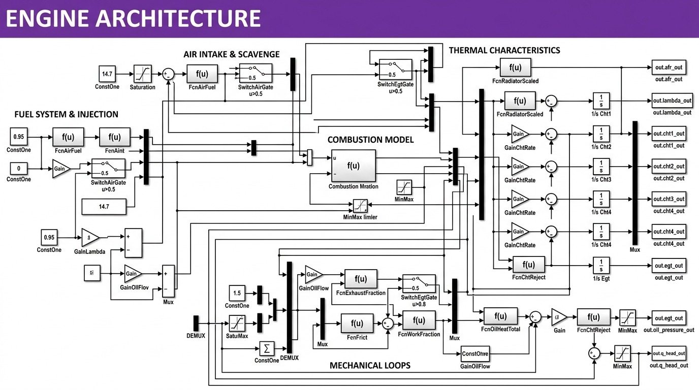
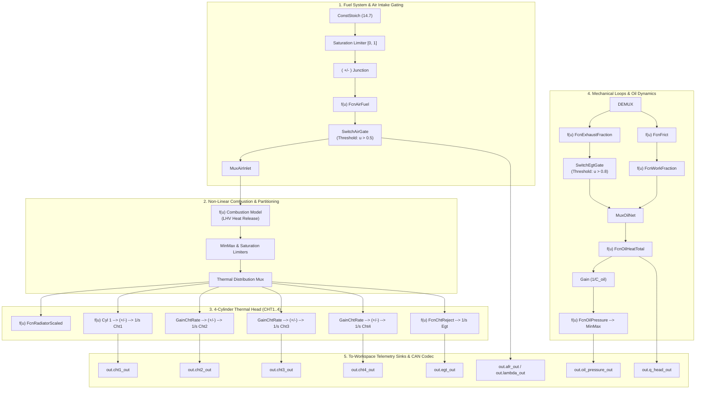

# ⚙️ MALE UAV Aero Piston Engine Architecture & Digital Twin Physics Model

This document outlines the high-fidelity mathematical plant and signal flow architecture for the **MALE UAV Aero Piston Engine** (TAPAS-BH-201 / Rotax 914/915 Turbocharged 4-Cylinder Boxer Engine) powering our AI/ML Digital Twin ecosystem.

---

## 🖼️ Engine Architecture Diagram

The engine architecture diagram models the multi-physics coupling between thermodynamic heat release, manifold air-fuel mixing, multi-cylinder thermal conduction/convection, lubrication dynamics, crankshaft rotational kinematics, auxiliary electrical generation, and CAN bus telemetry encoding.

*Vector SVG source file: [`docs/engine_architecture_diagram.svg`](engine_architecture_diagram.svg)*

---

## 🧩 Detailed Architectural Gates & Component Breakdown

---

## 🚪 Detailed Logical Gate & Switch Descriptions

1. **`SwitchAirGate` ($u > 0.5$)**:
   - **Function**: Governs manifold bypass gating between idle scavenge mode and active forced induction (turbocharger boost).
   - **Threshold**: When control input $u > 0.5$, routes high-density compressed air flow directly to `FcnAirFuel`; otherwise switches to atmospheric aspiration bypass.

2. **`SwitchEgtGate` ($u > 0.8$)**:
   - **Function**: Thermal protection bypass gate preventing simulated over-temp runaway in high-altitude loiter sorties.
   - **Threshold**: If normalized exhaust fraction exceeds $0.8$, routes excess enthalpy through the wastegate bypass channel.

3. **`Saturation` & `MinMax Limiter` Blocks**:
   - Bounds non-linear polynomial outputs (e.g. preventing negative fuel-air ratios, clamping thermal gradients, and enforcing physical ceiling limits on cylinder temperatures: $\le 250^\circ\text{C}$ CHT, $\le 950^\circ\text{C}$ EGT).

4. **Multi-Cylinder Heat Integrators ($1/s$ `Cht1` .. `Cht4`)**:
   - Individual numerical state integrators solving continuous-time transient heat accumulation:
     $$\text{CHT}_i(t) = \int_0^t \frac{1}{C_{\text{cyl}}} \left[ \dot{Q}_{\text{head}, i} - h_{\text{rad}}(\text{CHT}_i - T_{\text{cool}}) - h_{\text{air}}(\text{CHT}_i - T_{\text{amb}}) \right] dt$$

5. **`GainChtRate` & `GainOilFlow` ($\Delta$)**:
   - Parameterizes the relative thermal mass imbalance between adjacent cylinders (e.g., asymmetric ram-air cooling in boxer engine layouts where rear cylinders run hotter than front cylinders).

---

## 📐 Mathematical State Equations

### 1. Intake Air Flow & Fuel-to-Air Dynamics
$$\dot{m}_{\text{air}} = \left(\frac{\text{RPM}}{2500}\right) \cdot \theta_{\text{th}} \cdot \left(\frac{\rho_{\text{air}}(h, T_{\text{amb}})}{\rho_0}\right) \cdot \dot{m}_{\text{max}}$$
$$\text{AFR} = \frac{\dot{m}_{\text{air}}}{\dot{m}_{\text{fuel}} + \epsilon}, \quad \lambda = \frac{\text{AFR}}{\text{AFR}_{\text{stoichiometric}} \ (14.7)}$$

### 2. 4-Cylinder Thermal Head Heat Transfer ($\text{CHT}_1 \dots \text{CHT}_4$)
For each cylinder $i \in \{1, 2, 3, 4\}$:
$$C_{\text{cyl}} \frac{d\,\text{CHT}_i}{dt} = \dot{Q}_{\text{comb}, i} - h_{\text{cool}}\left(\text{CHT}_i - T_{\text{cool}}\right) - h_{\text{air}}\left(\text{CHT}_i - T_{\text{amb}}\right)$$
where $\dot{Q}_{\text{comb}, i} = \gamma_i \cdot \dot{m}_{\text{fuel}} \cdot \text{LHV} \cdot \eta_{\text{combustion}}$.

### 3. Exhaust Gas Temperature Dynamics ($\text{EGT}$)
$$\tau_{\text{egt}} \frac{d\,\text{EGT}}{dt} = T_{\text{flame}}(\Phi, \theta_{\text{inj}}, \text{RPM}) - \text{EGT}$$

### 4. Lubrication & Oil Dynamics
$$P_{\text{oil}} = f(\text{RPM}) \cdot \left(\frac{\mu_0}{\mu(T_{\text{oil}})}\right)$$
$$C_{\text{oil}} \frac{d\,T_{\text{oil}}}{dt} = \dot{Q}_{\text{friction}}(\text{RPM}, P_{\text{mech}}) - \dot{Q}_{\text{cooler}}(T_{\text{oil}} - T_{\text{amb}})$$

### 5. Crankshaft Kinematics & Brake Power
$$I_{\text{crank}} \frac{d\omega}{dt} = \tau_{\text{indicated}} - \tau_{\text{prop\_load}} - \tau_{\text{friction}}$$
$$P_{\text{mech}} = \tau_{\text{brake}} \cdot \omega, \quad \text{RPM} = \frac{60 \cdot \omega}{2\pi}$$

### 6. Electrical Generation Subsystem
$$P_{\text{alt}} = \eta_{\text{alt}} \cdot P_{\text{mech}}$$
$$I_{\text{alt}} = \frac{P_{\text{alt}}}{V_{\text{batt}}}, \quad \frac{d\,V_{\text{batt}}}{dt} = \frac{1}{C_{\text{batt}}} (I_{\text{alt}} - I_{\text{avionics\_load}})$$

---

## 📡 Mapping to Standardized CAN Bus DBC Frames (`0x100 - 0x105`)

| Output Signal Port in Diagram | DBC Message Name | CAN ID | DBC Signal Name | Engineering Range / Unit |
| :--- | :--- | :---: | :--- | :--- |
| `out.rpm_out`, `out.torque_out` | `ENGINE_CORE_DYNAMICS` | `0x100` | `engine_rpm`, `throttle_pos`, `engine_load` | $0 - 3000\,\text{RPM}$, $0 - 100\%$ |
| `out.cht1..4_out`, `out.egt_out` | `ENGINE_THERMAL_STATUS` | `0x101` | `cht_temperature`, `egt_temperature`, `oil_temp` | $20 - 250^\circ\text{C}$, $400 - 950^\circ\text{C}$ |
| `out.afr_out`, `out.lambda_out` | `FUEL_AND_AIRFLOW` | `0x102` | `air_mass_flow`, `fuel_flow_rate` | $0.0 - 0.25\,\text{kg/s}$, $0.0 - 0.02\,\text{kg/s}$ |
| `out.vibration_out`, `out.battery_volt_out` | `MECHANICAL_AND_ELECTRICAL` | `0x103` | `engine_torque`, `engine_power`, `vibration_rms`, `battery_voltage` | $0 - 250\,\text{Nm}$, $0 - 100\,\text{kW}$, $0 - 1.0\,\text{g}$, $20 - 32\,\text{V}$ |
| `out.alt_current_out` | `ELECTRICAL_AND_IGNITION` | `0x104` | `alternator_current`, `alternator_health`, `injection_timing` | $0 - 60\,\text{A}$, $0.0 - 1.0$, $5 - 35^\circ$ |
| Ambient & Flight Vectors | `FLIGHT_ENVIRONMENT` | `0x105` | `flight_altitude`, `ambient_temp`, `baro_pressure`, `air_density` | $0 - 10000\,\text{m}$, $-50 - 50^\circ\text{C}$, $20 - 105\,\text{kPa}$ |

---

## 🧠 Connection to AI/ML Feature Engine & Digital Twin

The signal flow modeled in this engine architecture feeds directly into:
1. **`DigitalTwinFeatureEngine`** (`backend/feature_engine.py`):
   - Computes expected values: $CHT_{\text{exp}}$, $EGT_{\text{exp}}$, $RPM_{\text{exp}}$.
   - Derives real-time physics residuals: $\Delta CHT = CHT - CHT_{\text{exp}}$, $\Delta EGT = EGT - EGT_{\text{exp}}$.
2. **Inference Microservices Pipeline**:
   - **Isolation Forest** (Anomaly Detection - 13 features)
   - **XGBoost Regressor** (Degradation Tracking - 120 features)
   - **Multiclass XGBoost Classifier** (5-Class Failure Mode Classification - 55 features)
   - **XGBoost Regressor + EMA Filter** (RUL Estimation & $90\%$ Confidence Bounds - 60 features)
